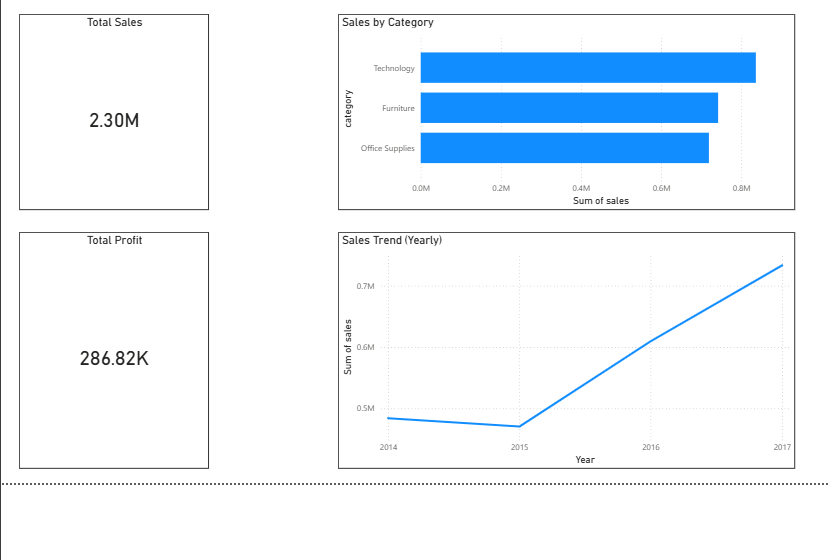

# Sales Performance Analytics

## Objective
Analyze retail sales data to understand revenue trends, profitability, and category performance.

## Tools Used
- Excel – data cleaning and preparation
- SQL Server – data storage and analysis
- Power BI – dashboard and visualization
- GitHub – version control and portfolio

## Dataset
Tableau Sample Superstore (Orders table)

## Data Preparation
- Cleaned and standardized dates
- Renamed columns to SQL-friendly format
- Removed duplicates
- Exported clean data for SQL analysis

## Key Insights
- Total sales of ~2.3M with overall profit of ~287K
- Technology is the highest revenue-generating category
- Strong sales growth observed after 2015

## Dashboard

## Project Structure
- data/cleaned_sales_data.csv
- sql/ (analysis performed in SQL Server)
- power_bi/sales_dashboard.pbix
